+++
title = "Park Pause: Premise and History"
description = "Park Pause is a meditative visual series and social practice that connects residents to infrastructure with viewpoints of select public parks. Park Pause is an open, cyber-physical participatory project."
date = 2019-08-06
weight = 0
draft = false
aliases = []
in_search_index = true
template = "page.html"
[taxonomies]
+++
# Premise

Can we use social media, video art, and intimate interviews to capture and share our relationships to others, to space, and to place? Can we recognize and share the beauty within complex societal systems? Can we foster agency and civic involvement in fun-yet-practical ways? Can we unite in an understanding of how common spaces shape our lives and our formative memories? These are the central questions of Park Pause.

> “People think the camera steals their soul. Places, I am convinced, are affected in the opposite direction. The more they are photographed (or drawn and painted) the more soul they seem to accumulate.” — John Pfahl

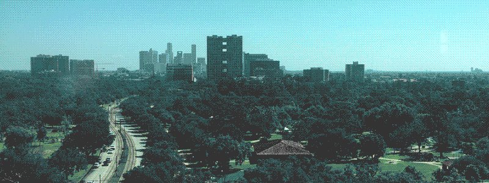
> > *Overlooking Fannin Pavilion at Hermann Park. June 2017.*

# History

One morning in October 2018 I woke up with a wild idea: film every single park located in Greater Houston. Each park would be rated using the Kaplan and Kaplan Preference Matrix: I, the host, would rate the coherence, complexity, legibility and mystery of each park’s landscape on a 5-point scale. As a digital native bathed in the waters of internet absurdism and a Wham City Comedy enthusiast, my vision for this series took the form of 15-second long comic sketches. The result would probably look something like Neature Walk meets Skunkpaste.

Could this truly be accomplished in 15-second sketches? Would the vastness of Greater Houston’s geography allow me to capture every single park? Maybe not. That’s the point, though. We love to see Sisyphus roll boulders uphill, we love it even more when there are no hills because it’s Houston so it’s basically Sonic 1 Easy Mode.

After gathering park inventories lovingly provided by the City of Houston’s parks department along with what I could fetch from the Harris County parks department’s GIS, I got to work.

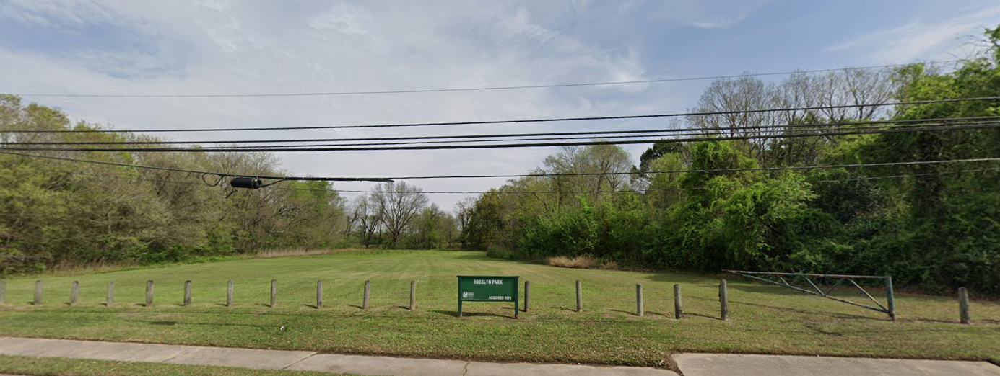
> > *Rosslyn Park, operated by the City of Houston. Google Maps. March 2019.*

Just kidding.

I realized that not only does Greater Houston include Harris County, but it also includes Fort Bend County, Montgomery County, Brazoria County, Galveston County, Liberty County, Waller County, Chambers County and Austin County. Greater Houston also comprises over 50 municipalities with over 10,000 inhabitants. That’s a lot of parks to review. The City of Houston’s parks department counts 40,000 acres of green space, which seemed doable. Greater Houston, the region, the blob that ate east Texas, probably included at least twice that many acres. I wanted to do this right. The Art Guys were able to define and visit the extreme north, south, east and west boundaries of the City of Houston. They did it right. As a silly sketch series, the effort required seemed insurmountable. So I took a break.

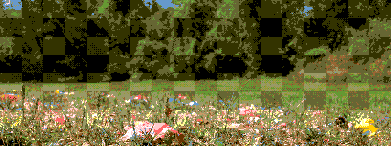
> > *Post-Easter litter at Terry Hershey. March 2016.*

# Pioneer

A week or so later, I heard about Pioneer through Learning Gardens (RIP). Pioneer is a fantastic notion: A tournament for creative people to pit their world-changing project ideas against one another in the arena of ideas. Very Silicon Valley. Winners receive $7,000 in funding and mentorship to turn their dream into reality. Past winning ideas include automated ultrasound analysis, nuclear fusion materials, and a decentralized communication app. Anyone from around the world, with any type of project proposal, can join.

I looked at my absurdist park review project with a different eye. What if this wasn’t about making people laugh at some of the incongruences apparent in the built environment of the Magnolia City? I had some experience ‘reading the landscape’ in a two-year stint as an assistant urban planner. The comedy of my original idea came from the struggle to overcome a defected sense of environmental interpretation.

Could I, a Zanni, take the discipline of interpreting space and place seriously? I thought about the form of a PBS travel documentary, and how mass communication develops icons. In the public consciousness, Houston isn’t as well defined as other cities I could name. Sure we can claim ‘first word on the moon’, ‘home of the eighth wonder of the world’ and ‘diverse, affordable culinary capital of the South’. It’s also known as an ‘uncool and ugly sprawlopolis’ and ‘notorious mess of concrete where it constantly floods’. Generic. Droning noise in the symphony of life.

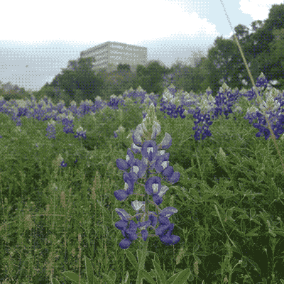
> > *Bluebonnets at Terry Hershey. March 2016.*

Houston. What do they know about it? The idea that Houston is ‘generic’ means more than some people might realize. Houston is everywhere. Car culture and real estate development work together to spread many American cities out like Houston. Outside of the mechanics of that beast development, what do they know about the bayou wilderness, the complexities of the prairies and marshes, the world-class birding destinations, the lost magnolia forests where black bears once roamed?

What about the social history? What do they know about the Karankawa or the Atakapa-Ishak people, who were divided into two populations known as the “The Sunrise People” and “The Sunset People”? How many know that the heroes of the Texas army were land speculators and slave traders? That Black slaves and Mexican prisoners of war were forced to clear the land to build the town of Houston? What do they know about KUHT, the first educational public television station, host to shows like People are Taught to Be Different, a 1958 collaboration between the University of Houston and Texas Southern University, that explored how racism clouds common human understanding?

What do they know? I lived in Seattle during Harvey. I could only sit while my mother was evacuated from her second-story apartment from her balcony. Days later, while much of Houston remained underwater, I remember going to the store and picking up some beer. The cashier caught my Texas ID and asked me if I had seen the pictures from Harvey. “Did you see the old people just sitting in the water?” I had. “Crazy, isn’t it?” she laughed. I wasn’t sure if it was nervous laughter or genuine schadenfreude. A month after Harvey made landfall, the apartment complex where my mother evacuated allowed its residents to re-enter their apartments and salvage their belongings. I flew to Houston to help my mother pack and clean up the ruins.

> > *Post-Harvey debris. September 21, 2017.*

Climate change will affect everyone. 2017 saw Harvey, 2018 gave Seattle its 4th hottest year on record in the past decade. Climate change will affect everyone. There is no escape except in each other. We should have common knowledge of sustainable development, and demand it as public infrastructure. With that in mind, I submitted a Pioneer application for Every Park in Greater Houston.

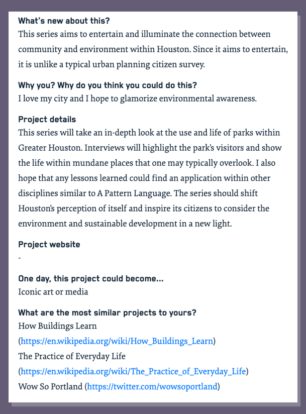
> > *Every Park in Greater Houston’s application for Pioneer. October 2018.*

The project somehow made it to semi-finals that month, even though it had more downvotes than upvotes. The downvotes made sense, figuring the project was up against people developing water well systems for their villages and creating human-readable programming code. I saved all the feedback, including the one that said I wasn’t quite a ‘lost Einstein’. I set the project to the side once again and began reading Yi-Fu Tuan’s Space and Place: The Perspective of Experience.

# Prototype

A few weeks later, Alex Singh announced the Prototype Web Residency, which would take place between January and April 2019. I iterated on my Pioneer proposal, changing the name to Park Pause and simplifying the goal: “A simple exploration of the public parks located in the city where I live. Meditative overviews of the parks’ features, including interviews with the parks’ users.” Why the new name? It’s a nod to Yi-Fu Tuan’s definition of place as pause:

> “In experience, the meaning of space often merges with that of place. “Space” is more abstract than “place.” What begins as undifferentiated space becomes place as we get to know it better and endow it with value… if we think of space as that which allows movement, then place is pause; each pause in movement makes it possible for location to be transformed into place.”

> “Place is a pause in movement. Animals, including human beings, pause at a locality because it satisfies certain biological needs. The pause makes it possible for a locality to become a center of felt value… A person recovering from sickness is aware of his dependence on others. He is aware that he is cared for and made well at a specific locale, which may be the shade of a tree, a lean-to shelter, or a fourposter bed… The lasting affection for home is at least partly a result of such intimate and nurturing experiences.”

Why the new goal? I stumbled upon an 1987 segment of a program called Eyes of Texas that focused on Buffalo Bayou. By surprise, the show included a 30-second harp loop underscoring a view of herons flying over the bayou. I figured if a local news station would air something so meditative in 1987, why not try to produce a whole meditative series about public parks today?

The residency took place online. It was less about me connecting with other artists while inhabiting another location than an extension of me connecting with other artists while I both inhabited Houston and the vast expanse of cyberspace. Know what I’m talking about? It was a treat. I met many wonderful artists and practitioners who provided insightful feedback, including Emma Rae Norton (who encouraged me to synthesize my original slapstick idea with the current loftier vision — we’ll see), Benjamin Earl (thanks for the introduction to Doreen Massey and A Global Sense of Place), Brendan Schlagel (whose Amble event idea I plan to incorporate into future Park Pause episodes), Hannah Blows and Ash Louns.

> > *Terry Hershey Park in OpenStreetMap.*

# Hershey

During those months I filmed at Terry Hershey Park, a park I had familiarized myself with after living next to it for about two years. Terry Hershey was an environmental activist in Houston who sparked some of the original efforts to stop Harris County’s channelization of Buffalo Bayou in the late 1960s. The park itself is a buffer zone that runs along 6 miles of Buffalo Bayou between the Barker Reservoir and Beltway 8, including a north fork that connects to the Addicks Reservoir. The district around Terry Hershey Park is known as the Energy Corridor, a place that holds the offices of BP America, Shell Oil Company, ConocoPhillips and Citgo Petroleum Corporation.

Terry Hershey, and the Energy Corridor in general, sits within the Addicks and Barker Reservoirs’ controlled outflow zone. After Harvey, the unprecedented amount of water that these reservoirs held necessitated the US Army Core of engineers to perform two weeks of ‘high-volume controlled release’. This effectively flooded the Energy Corridor for almost a month, literally bringing the effects of climate change and unchecked development into the oil and gas industry’s backyard.

Today, two years after Harvey, Harris County started to clear the riparian zones of Buffalo Bayou at Terry Hershey Park to introduce ‘stormwater detention compartments’. It is a bitter case of irony. As Save Buffalo Bayou, a group inspired by Terry Hershey’s Save Buffalo Bayou campaign in the 1960’s, mentions: “removing the trees and vegetation and compacting the soil with heavy equipment, as Flood Control routinely does, reduces the ability of the land to absorb rain runoff and inhibits plant growth.”

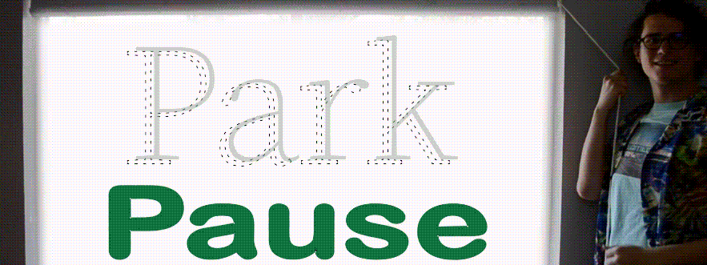
> > *An early logo sequence and frame experiment.*

# Pause

I filmed at three segments of Terry Hershey and created videos for each segment, experimenting with the concept of a meditative series/slow television for public parks. You can check them out here: Park Pause: Terry Hershey.

Before Spring arrived, I felt like some of the viewpoints I filmed were ugly. The bare overlapping branches of red mulberry, dogwood and yaupon holly layered into an undifferentiated muddiness against the beige sediment lining the dirt-colored bayou.

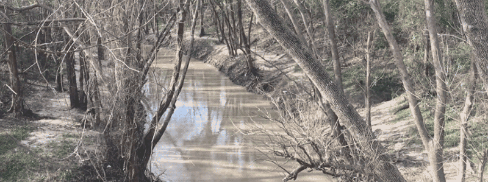
> > *A section of Terry Hershey. January 21 2019.*

Just a few steps away from the bayou, though, were points of color and interest. A bald cypress enjoyed swaying its tree hair back and forth. Underneath it, coneflowers danced amongst a gradient of plume-grass, leaves spread out as if imitating the transmission lines above them.

> > *A part of the January 21 2019 video, mid-transition.*

Thunderstorms heralded the arrival of spring, bringing more wildflowers and a lush, complex density of leaves, vines and bush I wish I could depict with words. Soon the residency was over. When it was done, I set Park Pause aside for a bit.

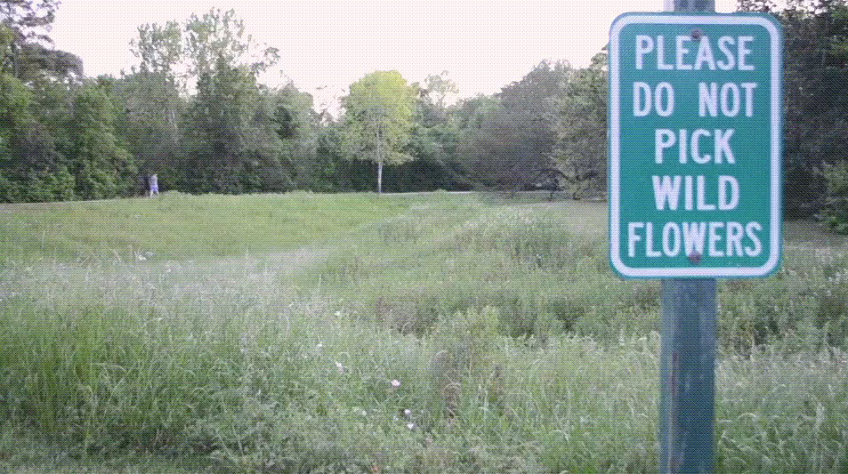
> > *Signage at Terry Hershey. March 26, 2019.*

# Montage

During the time of the residency and after it ended, I started taking broadcast classes at the local public access station. I attended a panel and lecture about critical infrastructure studies. I found out about The Center for Land Use Interpretation. I saw an immersive performance of a play called Gentefied, which contrasts the precarious life of undocumented workers against the privilege of citizens during a strike. Later I searched through the news to find that an international conglomerate shut down a landmark coffee plant in the East End after a union strike in 2018.

I watched A Bread Factory with my friend Corey Bobco. The two-part film details a small-town community theatre that loses funding to an ‘avant-garde’ group, with some shady connections between an international conglomerate and the town’s mayor. Corey later visited the Anthology Film Series in New York and gifted me a card featuring all the films in their Infrastructure on Film Series. I listened to the entirety of an old friend’s podcast, Joe Reviews Intersections On His Walk to Work, a dry take on NPR storytelling shows with a similar infrastructural theme (I recommend the whole thing but Episode 5 is my favorite). Little did I know that around the time Joe released an episode where he proposes that someone review every park in Houston, I had woke up with a thought to do just the same.

> > *A section of Terry Hershey Park nearby Beltway 8. March 3 2019.*

I attended an event called Design for Houston, where I collaborated on a project called Uplift the Future. It helped me see a lot of overlapping ideas and organizations working within the intersection of art, technology and citizen power. Later, I read an update from Project Row Houses fellow Libby Bland about ethical engagement and community organizing that had me reconsider how I approach under-resourced communities. I read Trace by Lauret Savoy, inspiring a vision of the American landscape as a place where those in power have smudged away, but not fully erased, groups with their own histories and relations to the land. On a trip to California, I visited the Oakland Museum of California’s Queer California exhibition, where Parkeology’s installation played interview recordings from Balboa Park. My friend Lukas and I ate lunch, and I heard about Lukas’ upcoming plans for a workshop about people’s relationship with bodies of water.

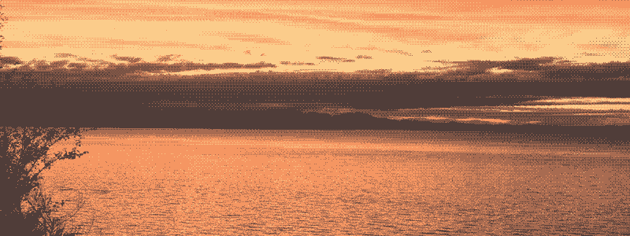
> > *Overlooking Shilshole Bay at Discovery Park in Seattle, WA. August 2017.*

When I returned home I refreshed my web presence, changing my handles on YouTube and Instagram to ‘Lazy at Churches’. It’s an anagram of my name and also speaks to my relaxed spiritual nature. I learned more about features of ADHD such as social anxiety and rejection sensitivity dysphoria. Giving a name to these, especially RSD, explained a lot of my difficulty interviewing park users, sharing my work online, and even leaving the house at all.

# Platform

Weeks after the end of the residency, I could not find motivation to finish and deliver a finished, 30-minute episode of Park Pause. One day my partner told me that Ian Simpson (aka Kevin Abstract) of Brockhampton planned to hold a performance, a type of situation, an “integrated ensemble of behavior in time”, near his childhood home in Corpus Christi: he would walk on a treadmill for 10 hours straight, open to anyone, and live stream it. He called it #THE1999. Next to his childhood home sat a park named Brighton Park.

> > *Defining the present location. Wayfinding for Brighton Park. April 26, 2019.*

Given that this was a participatory performance event within a public park, given that Brockhampton redefines homophobic spaces by its existence, and given that Corpus Christi is only a three hour drive away, I decided to bring Park Pause whether or not it took place in Houston. Houston and Corpus both lie on the Texas coastal bend. Texas Parks and Wildlife places Houston in the same ecoregion as Corpus: Gulf Prairies and Marshes. Harvey destroyed up to 80% of homes and buildings in Rockport, a city within the Corpus Christi metropolitan area.

When I arrived, Ian had been walking for seven hours. A chattering crowd circled the treadmill. My heart raced while I gathered my equipment, preparing to record a few viewpoints of Brighton Park. I must have looked like a rejected Fortnite character: I didn’t have time to rent equipment from the public access channel so I carried a tall tripod, camera bag, and wore a backpack stuffed with two more tripods. Whichever spaces called to me became a viewpoint under the setting sun.

> > *A bench in Brighton. April 26, 2019.*

Brighton Park sits south of Brockhampton Street, near a bend where Brockhampton turns into Bronx Drive. Facing south, a motte of gnarled live oaks and honey mesquite trees frame a suburban tableau: a pink-blue gradient sky falling on the roofs of recently constructed homes, delineated from the rest of space by a flat-top picket fence. Parallel to the fence-free swath of nature and recreation that defines Brighton Park, the bordered cul-de-sac homes face each other in an isolating posture.

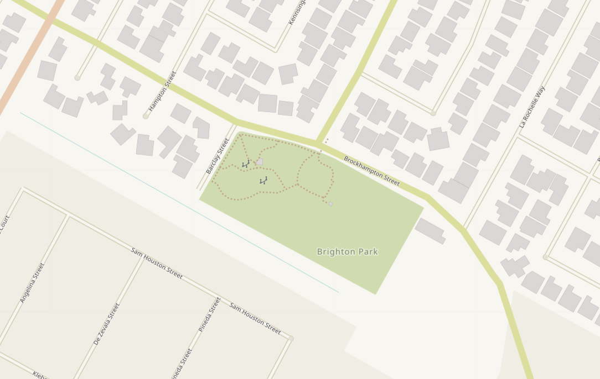
> > *Brighton Park in OpenStreetMap.*

Brighton is rectangular in form, covering about 4 acres with a gazebo, shaded benches, a playground, basketball court and baseball field. To the east is a small spur off Brockhampton called Barclay Street. To the west, 4 acres of unplatted land filled with trees. A stormwater channel borders the entirety of Brighton’s southern edge and drains into Oso Bay about two and half miles west. Brighton Village, the neighborhood that built Brighton Park, started construction in 1989. Evidence of inhabitation of the area dates back to 3,000 BC.

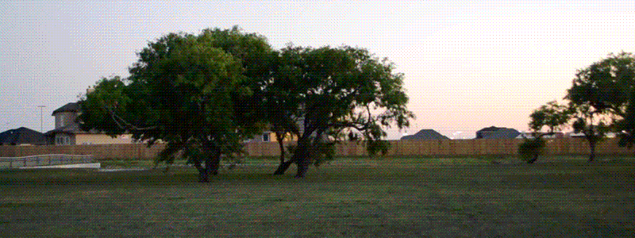
> > *Facing south in Brighton Park. April 26, 2019.*

Ian Simpson, as Kevin Abstract, was my first Park Pause interviewee. The interview questions I asked were developed near the beginning of the Prototype Web Residency. They were intended to draw forward memories and dreams related to the park and its surroundings. Research in environmental psychology and human geography inspired some of the questions. I found most benefit from Ellen Hostetter’s Reading Place, Reading Landscape.

> > *Selection from object-centered questions in landscape geography. Ellen Hostetter, 2016.*

Kevin’s answers were beautiful. From bygone days on a tire swing with a lost friend to the potential of never starting Brockhampton, his answers held a fictive intensity about them that my partner described as a “light troll”. I would not expect less from the self-made suburban soap opera star creator of American Boyfriend.

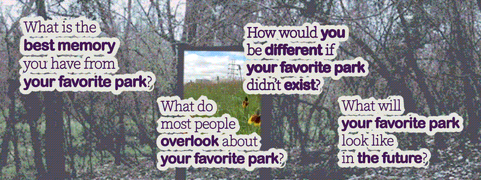
> > *The four Park Pause interview questions.*

After interviewing Kevin, he asked if I could step on the treadmill for him while he went to the bathroom. He told me to explain my purpose behind all of those questions to everyone at the event, both online and in person. My voice trembled in surprise, as I only came to Brighton to find some answers relating #THE1999 to public infrastructure. My wonky elevator pitch for Park Pause lasted a short time, thankfully, and Kevin soon returned. I stepped off the treadmill and thanked him for his work.

My phone started ringing as a variety of different numbers called me. I realized that I had left my phone number on Park Pause’s instagram profile. I signed a wavier determining that I was responsible for my safety on the treadmill and also signed a release for the use of my image. The representative told me he thought it was cool that I was filming the filmed event. I set up my tripods in a corner a few feet away from the treadmill and interviewed a slew of amazing people. I left Corpus Christi around 9:30 pm with over an hour and a half of audio and video footage.

Editing the footage into a 20 minute YouTube episode while working a full time job taxed me more than expected. I worked my day job for eight hours a day and then worked on Park Pause for about six hours a night. It took me over two weeks, synchronizing audio and video, arranging interview segments into a cohesive show, designing broadcast elements and writing text that formed the basis for my voiceover. The amount of work required to create that 20-minute episode shocked me senseless, but I’m proud of it. Somehow I touched on ideas from collective memory scholars without knowing it (monuments/events).

When the thought to go to Brighton first occurred to me I wondered whether or not I should go. I still wonder about it to this day. Am I a cringey self-promoting clout chaser with little empathy or regard for Ian Simpson’s work? I hope not. Here’s how I justify it: distribution is one of the hardest problems for artists to overcome. I believe Brockhampton recognizes this and worked as hard as they could to develop methods to create, share and saturate the market with their own work. They built a platform for mass communication, represented by the whole structure of #THE1999: the platform of the treadmill, the live audience, the multiple cameras, and the production control room coordinating the live stream itself. Given Ian’s decisions to allow people on the treadmill and make the crowd at #THE1999 sit and listen to other musicians, I believe it acted as an open platform for some talented people to show their own hard work. It also acted as a transformative space of queer self-love. For me, I tried my best to focus on Park Pause (of course, I had to throw in some silly Houston love because I am silly and love Houston). After our interview HK, Brockhampton’s creative director, told me “You’re using what you’ve got. We respect that.”

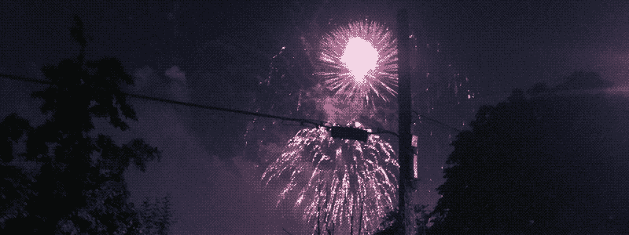
> > *A communications utility pole foregrounding fireworks. Seattle, WA. July 4, 2017.*

In fairness, though, I must press another element to #THE1999 that makes the participatory aspect ambiguous. Celebrity is hell. Without supervision it can take a toll on a person’s physical, emotional and spiritual well-being. Instead of living life as a person with human behavior, including base behavior like eating and pissing, a celebrity becomes a living icon. Ian-as-Kevin gave a lot to his fans that day. Regular fans were given collective sublimity. Some well-deserving fan-creators were blessed to perform in front of a silent, sitting crowd. For some fan-creators, Kevin shared part of the hell of icon-life by reminding them of their base human functions, and thus their mortality, then making them walk and give their energy to the platform of Brockhampton.

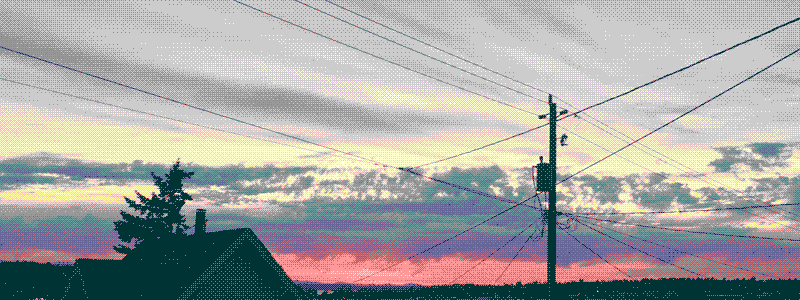
> > *Joint distribution utility pole. Seattle, WA. June 27, 2017.*

If landscapes are power, then by hosting #THE1999, Brockhampton redirected that power to fans. When Kevin asked a fan-creator to step on the treadmill, he shared that power’s virtues and shortcomings. #THE1999 and Brighton Park connected Brockhampton fans together, in real-time for 10 hours, through an amble within an interlaced cyber-physical landscape.

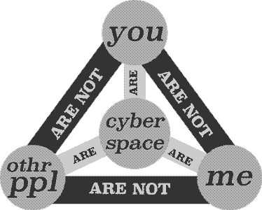

# Continuing

There’s still a long way to go before Park Pause becomes the iconic media I envisioned nearly a year ago. Park Pause 001 has a 20-minute YouTube edit complete, but I still need to create a 30-minute broadcast edit. I have some footage for another episode about Terry Hershey but I have not started it. I keep thinking back to the fast-paced, surreal comedy vision I had in October. Should I do an everyday aesthetics Park Pause episode in which I try to review the smallest parks in every district within the City of Houston?

One of my original hopes for Park Pause was to glamorize environmental awareness. Is it possible to combine that hope with comedy? Maybe I should talk to Ruby McCollister. Maybe I should get more active in my community again. Houston houses a great share of other infrastructure-focused social practice artists, researchers and resources. Earlier this week I collaborated with Carrie Schneider to create a waterscape. She sent the YouTube edit of Park Pause 001 to the director of the Community Design Resource Center. There’s an underutilized environmental science center nearby where I live… The possibilities are endless. I better focus!

> > *“EVIL ANGEL + ANGELIC DEMON 2 HALFS… 1 WHOLE” Found in Houston, TX. June 3, 2017.*

We are a generation undergoing a great reckoning. However, we can still form a society that meets the needs of its people and makes it easier for them to thrive. Right now, we should encourage mutual trust as we experience change. We can encourage trust by going outside and exploring the common meanings within our local communities. By sharing our stories and relationships with space, place and each other through the web, we can use the tools of our digital age to redefine public memory in service of the oppressed.